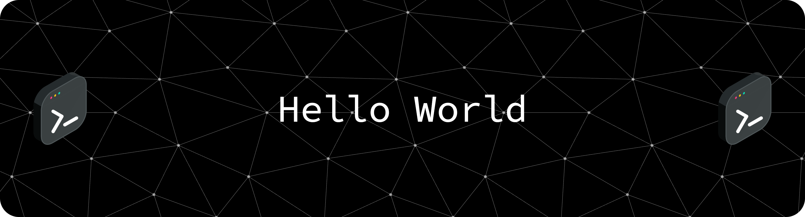

  

  
  
  
  
  
  
  
  
  
  

  <strong>
    🚀 Junior web developer focused on building clean, reliable and practical solutions. 
    Experienced with WordPress, PHP, and front-end technologies, and continuously improving my skills in modern development patterns, architecture, and performance optimization.
  </strong>

  

---
